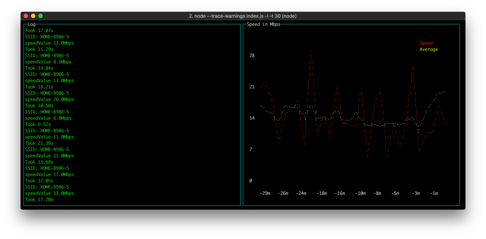

How's My WiFi
=============

**HIGHLY EXPERIMENTAL BUT ALSO TOTALLY HARMLESS**

Measure (repeatedly) your broadband speed using Fast.com in a headless browser.

Yes, WiFi isn't broadband and broadband isn't WiFi but ultimately, what
is the speed you get on [Fast.com](https://fast.com)? That's the speed
of your connection to the Interwebs. The WiFi from your laptop to your
router is unlikely to be the bottleneck so this ultimately measures your
broadband.

This is a NodeJS script that opens `https://fast.com` with a headless
browser, hangs on till it gets a speed measurement. Then it records this
number in a database.

You run it like this:

    node index.js

The goal is to comprehend how your Internet speed is fluctuating.
Perhaps Comcast is telling, for $100 a month you get "Up to 75Gbps"
but what good is that if it turns out it hovers around 0.5Gbps most of
the time?

How To Install It
-----------------

With `npm`:

    npm install howsmywifi

With `yarn`:

    yarn add howsmywifi

What Does It Look Like?
-----------------------

Like this:

Yeah, it ain't pretty. Neither is the code, but it's a start.

LICENSE
-------

MIT.
